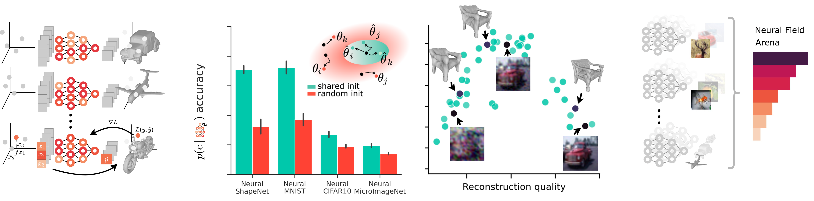

# 🚀 `fit-a-nef`

*Quickly fit neural fields to an entire dataset.*

Creators: [Samuele Papa](https://samuelepapa.github.io), [Riccardo Valperga](https://twitter.com/RValperga), [David Knigge](https://twitter.com/davidmknigge), [Phillip Lippe](https://phlippe.github.io/).

[](https://opensource.org/licenses/MIT)
[](https://www.python.org/downloads/release/python-390/)
[](https://github.com/psf/black)
[](CODE_OF_CONDUCT.md)
[](https://fit-a-nef.readthedocs.io/en/latest/)


**Official repository of _both_ the `fit-a-nef` library, and the example of how to use it effectively.**

📚 This code is the base for the benchmark and study in:  [How to Train Neural Field Representations: A Comprehensive Study and Benchmark](https://fit-a-nef.github.io/) .

⚙️ For the *neural dataset collection* and to use the neural fields
as *representations*, see the [neural-field-arena](https://github.com/samuelepapa/neural-field-arena) repository.

## Motivation

Using the ability of JAX to easily parallelize the operations on a GPU with `vmap`, a sizeable set of neural fields can be fit to distinct samples at the same time.

The `fit-a-nef` library is designed to easily allow the user to add their own *training task*, *dataset*, and *model*. It provides a uniform format to store and load large amounts of neural fields in a platform-agnostic way. Whether you use PyTorch, JAX or any other framework, the neural fields can be loaded and used in your project.

This repository also provides a simple interface that uses [optuna](https://optuna.org/) to find the best parameters for any neural field while tracking all relevant metrics using [wandb](https://wandb.ai/).

<!-- TABLE OF CONTENTS -->

## Table of Contents

- [Getting started with 🚀 `fit-a-nef`](#getting-started-with-fit-a-nef)
  - [Installation](#installation)
  - [Basic usage](#basic-usage)
  - [Documentation](#documentation)
- [The repository](#the-repository)
  - [Optional dependencies](#optional-dependencies)
  - [Repository structure](#repository-structure)
  - [Usage](#usage)
- [Citing](#citing)
- [Contributing](#contributing)
- [Code of conduct](#code-of-conduct)
- [License](#license)
- [Acknowledgements and Contributions](#acknowledgements-and-contributions)

<!-- END OF TABLE OF CONTENTS -->

## Getting started with 🚀 `fit-a-nef`

For further information see the [documentation](https://fit-a-nef.readthedocs.io/en/latest/).

### Installation

To use the `fit-a-nef` library, simply clone the repository and run:

```bash
pip install .
```

This will install the `fit-a-nef` library and all its dependencies. To ensure that JAX and PyTorch are installed with the right CUDA/cuDNN version of your platform, we recommend installing them first (see instructions on the official [Jax](https://jax.readthedocs.io/en/latest/installation.html) and [Pytorch](https://pytorch.org/get-started/locally/)), and then run the command above.

### Basic usage

The basic usage of the library is to fit neural fields to a collection of signals. The current signals supported are images and shapes (through occupancy).

The library provides a `SignalTrainer` class, which supports the fitting of signals given coordinates. This library is agnostic to the type of signal being used. Additionally, it provides the basic infrastructure to store and load the neural fields in a platform-agnostic way.

Images and shapes can be fit using the `SignalImageTrainer` and `SignalShapeTrainer` classes, respectively. These classes are agnostic to the type of neural field being used. For example, `SignalImageTrainer` can be used to fit images with a SIREN, or an RFFNet.

The trainer classes have a `compile` method which can be used to trigger the `jit` compilation, and a `train_model` method to fit the neural fields to the signals provided.

To handle initialization, the library provides `InitModel` classes which can be used to initialize the weights of the neural fields. These classes are agnostic to the type of neural field being used. For example, `SharedInit` is used to initialize all the neural fields with the **same** _random_ weights, and `RandomInit` is used to initialize the neural fields with different random weights.

Finally, the library has several neural field architectures already implemented. These can be found in the `fit_a_nef.nef` module.

### Documentation

For the full documentation, see [here](https://fit-a-nef.readthedocs.io/en/latest/).

**After fitting the neural fields, you can use them as representations for downstream tasks. For example, you can use them to classify images or shapes, or to reconstruct the input signal. For this, we recommend using the framework-independent datasets defined in the [neural-field-arena](https://github.com/samuelepapa/neural-field-arena) repository.**

## The repository

The library provides trainers that allow fitting images and shapes. Additionally, it allows reliable storing of large-scale neural datasets and has code for several neural field architectures.

However, to improve flexibility, the library does not ship with specific datasets or a defined config management system. This repository is meant to provide an example and template on how to correctly use the library, and allow for easy extension of the library to new datasets and tasks.

For some of these, more dependencies are required, which can be found under _Optional dependencies_ above and on the [INSTALL.md](INSTALL.md) file.

### Optional dependencies

Depending on the use case you are aiming for with `fit-a-nef`, additional optional dependencies may be beneficial to install. For example, for tuning hyperparameters of the neural field fitting, we recommend installing `optuna` for automatic hyperparameter selection and `wandb` for better logging. Further, if you want to use a specific dataset (e.g. ShapeNet or CIFAR10) for fitting or tuning, which is set up in this repository, ensure that all dependencies for these datasets are met. You can check the needed dependencies by running the simple tuning image and shape tasks (more info on how to do that below).

### Repository structure

The repository is structured as follows:

- `./config`. Configuration files for the tasks.
- `./fit_a_nef`. **Library** for quickly fitting and storing neural fields. *Here you can add the trainer for your own task and your own NeF models*.
- `./dataset`. **Package** to load the targets and inputs used during training. *Here you can add your own dataset*.
- `./tasks`. **Collection** of the tasks that we want to carry out. Both fitting and downstream tasks fit here. *Here you can add the fitting scripts for your own tasks*.
- `./tests`. Tests for the code in the repository.
- `./assets`. Contains the images used in this README.

### Usage

The basic usage of this repository is to fit neural fields to a collection of signals. The current signals supported are images and shapes (through occupancy).

Each task has its own `fit.py` file which is called to fit the neural fields to the provided signals. The `fit.py` file is optimized to provide maximum speed when fitting. Therefore, all logging options have been removed.

Let us look at a simple example. From the root folder we can run:

```bash
python tasks/image/fit.py --nef=config/nef.py:SIREN --task.train.end_idx=10000 --task.train.num_parallel_nefs=2000"
```

This will fit 10k SIRENs each to a different sample from CIFAR10 (the default dataset). This will be done with 2k NeFs in parallel.

For more details, refer to the [how-to](HOWTO.md) guide.

## Citing

If you use this repository in your research, use the following BibTeX entry:

```bibtex
@misc{papa2023train,
  title={How to Train Neural Field Representations: A Comprehensive Study and Benchmark},
  author={Samuele Papa and Riccardo Valperga and David Knigge and Miltiadis Kofinas and Phillip Lippe and Jan-Jakob Sonke and Efstratios Gavves},
  year={2023},
  eprint={2312.10531},
  archivePrefix={arXiv},
  primaryClass={cs.CV}
}
```

## Contributing

Please help us improve this repository by providing your own suggestions or bug report through this repository's GitHub issues system.
Before committing, please ensure to have `pre-commit` installed. This will ensure that the code is formatted correctly and that the tests pass. To install it, run:

```bash
pip install pre-commit
pre-commit install
```

## Code of conduct

Please note that this project has a Code of Conduct. By participating in this project, you agree to abide by its terms.

## License

Distributed under the MIT License. See `LICENSE` for more information.

## Acknowledgements and Contributions

We thank Miltiadis Kofinas, and David Romero for the feedback during development.
